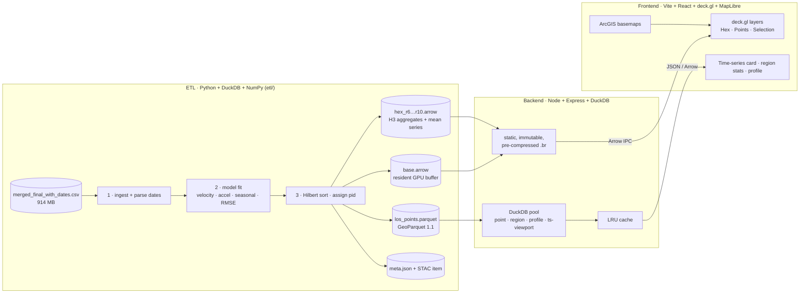

# PHASE: PSInSAR LOS Deformation Explorer

### Design & build plan: 2.6 million Sentinel-1 persistent scatterers, streamed from GeoParquet to the GPU

> Status: **built** (2026-09-27). See §12 for where the build differs from this plan. This document covers what the data is, how it is converted, how it reaches the browser, what the interface looks like and moves like, and the order it gets built in.
> Sister project: `D:\Geoparaquate` (Haryana Web GIS). PHASE reuses its GeoParquet + DuckDB + MapLibre patterns and covers the same region.

---

## 0. Summary

| Decision | Choice | Why |
|---|---|---|
| Storage | **GeoParquet 1.1**, Point geometry, Hilbert-sorted, 100k-row groups, ZSTD | Same pattern as `Geoparaquate`; bbox pruning, column pruning per epoch |
| Derived science | Computed **once in ETL** (vectorised least-squares on a 2.6M × 34 matrix) | Browser never fits models; click → instant chart |
| Map rendering | **deck.gl 9 on MapLibre GL 5** (interleaved `MapboxOverlay`) | 2.6M points at 60 fps on a normal GPU; GPU filtering and animation |
| Point delivery | **Resident mode**: one binary Arrow buffer of all points (≈ 26 MB, ≈ 14 MB over the wire). **Tiled mode** for phones and future datasets > 6M points | No tile pop-in, instant recolour/filter; tiled path keeps it scalable |
| Overview | **H3 hex aggregates** (res 6–10), precomputed | Readable at state scale, loads in < 300 ms, drawn before points arrive |
| Time animation | Epoch-major displacement arrays + **custom deck.gl shader extension** that interpolates between two epochs on the GPU | Smooth scrub/play with no per-frame CPU work |
| Backend | **Node 20 + Express + DuckDB** (same stack as `Geoparaquate`) | Reuse LRU cache, LIFO worker pool, middleware |
| Frontend | **Vite + React 19 + TypeScript**, Zustand, d3 (scales/shapes), Motion | Matches `Geoparaquate/frontend` deps (React 19, framer-motion already there) |
| Chart | Hand-built **SVG + d3** time-series card | Full control over the draw-in / morph animation |

---

## 1. The data

### 1.1 File profile (`merged_final_with_dates.csv`, measured with DuckDB)

| Property | Value |
|---|---|
| Size | 914.6 MB |
| Rows (scatterers) | **2,617,185** |
| Columns | 37 = `Longitude`, `Latitude`, `Average LOS`, 34 date columns |
| Types | all `DOUBLE`, **no nulls** |
| Extent | lon 75.596 → 77.998, lat 27.424 → 31.302 (EPSG:4326) |
| Coordinate precision | 5 decimals (≈ 1.1 m) |
| Exact duplicate coordinates | 22,643 (rounding collisions; distinct scatterers) |
| Epochs | 34, from **18/03/2016** to **25/12/2024** (8.77 years), roughly quarterly |
| Largest gap | 07/06/2019 → 04/12/2019 (180 days; Sept 2019 missing) |
| Date format in header | `DD/MM/YYYY` |

**Region.** The points run from Delhi NCR up through Haryana to the Chandigarh tricity and Ludhiana, the same area as `Geoparaquate`. Densest 0.1° cells: Gurugram (60.5k points), South Delhi (58.8k), Faridabad / East Delhi (54k), Mohali–Chandigarh (43k), Ludhiana (37k). The densest 1 km² cell holds 4,053 points; the median occupied cell holds 15.

### 1.2 What the numbers are

- **`Average LOS`** is the mean line-of-sight velocity in **mm/yr**. Range −54.3 → +19.3, median +0.47, p02 −21.6, p98 +9.7.
- **Date columns** are **cumulative LOS displacement in mm** at each acquisition.
- Check: velocity correlates with (last − first) / 8.77 yr at **r = 0.92**, so the two agree.
- **The data is spatially de-meaned.** Mean velocity across all points is 7 × 10⁻⁹ and every epoch's spatial mean is ≈ 0. Values are **relative to the scene average**, not to a stable ground reference. The UI must say this, and must let the user pick a reference point or area (§6.5).
- **Source: StaMPS, Sentinel-1 ascending** (confirmed). StaMPS's default reference (`ref_centre`/`ref_radius` = whole scene) is the mean of all PS, which is exactly what the profile shows.
- A point's series does **not** start at 0 (first point starts at 56.8 mm). No epoch is 0 for every point, but the spread across points is smallest at **04/12/2019** (σ 35.7 mm, vs 46.5 at the first epoch and 49.9 at the last), so the StaMPS master image is most likely near Dec 2019. Corrections applied after the time series (DEM error, atmosphere filtering) leave per-point offsets, so the master column is not exactly 0. For display the series is re-based to the first epoch: `d'(t) = d(t) − d(t₀)`. A "re-base to master" option is kept.
- **The series are noisy.** The median largest jump between consecutive epochs is 47 mm, p99 is 143 mm. So the chart shows a fitted model and a residual band, and every point gets a quality score.

### 1.3 Velocity distribution (5 mm/yr bins)

```
 -55 ▏                                   377
 -50 ▏                                 2,831
 -45 ▏                                 2,959
 -40 ▏                                 5,734
 -35 ▏                                 7,237
 -30 ▏▌                               15,599
 -25 ▏█                               27,956
 -20 ▏█▎                              36,193
 -15 ▏█▌                              42,793
 -10 ▏██▍                             67,036
  -5 ▏█████████████████████████▍     877,956
   0 ▏██████████████████████████████████ 1,198,672
  +5 ▏████████▎                      287,266
 +10 ▏█▏                              40,398
 +15 ▏                                 4,178
```

Strong left tail = subsidence hotspots. The worst 0.05° cells: **Mohali / Zirakpur (76.70 E, 30.65 N)**, mean −36.9 mm/yr over 12.9k points, min −54.3; **Panchkula / Ambala belt (76.85 E, 30.30–30.35 N)**, −29 to −37 mm/yr. The colour scale has to be asymmetric-aware (§5.3).

---

## 2. Sentinel-1 PSInSAR context (drives UI decisions)

| Fact | Consequence in the UI |
|---|---|
| C-band, λ = 5.547 cm. Only the component along the radar line of sight (LOS) is measured | Label everything "LOS". Show a **LOS compass**: satellite heading, look direction, incidence angle |
| **Ascending pass** (confirmed): satellite flies roughly north (heading ≈ −10°, i.e. 350°), right-looking, so the radar looks **east-northeast (LOS azimuth ≈ 80°)** | Compass fixed to ascending geometry. Eastward ground motion also reads as "toward"; westward as "away". Tooltip says so |
| Incidence angle across IW swath is ≈ 29°–46° | Optional **"≈ vertical" toggle**: `d_v ≈ d_LOS / cos θ`, assuming purely vertical motion. θ defaults to 39° and can be edited. Clearly marked as an approximation |
| Nearly blind to north–south motion (near-polar orbit) | Tooltip on the compass explains it |
| Sign (StaMPS convention): negative = away from satellite (subsidence if motion is vertical), positive = toward (uplift) | Colour red = away, blue = toward. Legend says "away / toward satellite", with "subsidence / uplift" as a secondary label |
| PS = stable, phase-coherent reflectors (buildings, rock, infrastructure). Dense in cities, sparse on farmland | At low zoom the hex layer shows **point density** as opacity so empty farmland does not read as "stable" |
| Relative measurement against a reference (here: scene mean). **No GNSS station available** | **Re-reference** tool (§6.5) with **automatic stable-area candidates** (ETL step 7b), since there is no ground truth to tie to |
| Phase ambiguity: jumps > λ/4 ≈ 13.9 mm between epochs can be unwrapping errors | Quality flag `jump_flag` when a consecutive jump is > 3σ of that point's residuals. Flagged epochs drawn as hollow dots in the chart |
| Sentinel-1B failed Dec 2021; revisit dropped from 6 to 12 days | Timeline marks the S1B loss as an annotation. Epochs here are quarterly, so there is no visible gap, but the note matters for interpreting noise |
| Seasonal signals: groundwater pumping, thermal expansion of buildings | ETL fits an annual sinusoid; chart can overlay the seasonal model. Map mode "seasonal amplitude" |

---

## 3. Architecture



### 3.1 Two delivery modes

| Mode | When | How |
|---|---|---|
| **Resident** (default desktop) | total points ≤ 6M and device memory ≥ 4 GB (`navigator.deviceMemory`) | Fetch `base.arrow` once, stream record batches in Hilbert order so the map fills in spatially coherent patches. All recolour, filter and velocity-mode switching then happens on the GPU with zero network |
| **Tiled** (phones, huge datasets) | otherwise | deck.gl `TileLayer` fetching `/api/tiles/{z}/{x}/{y}.arrow` (DuckDB bbox query on the Hilbert-sorted parquet, same LIFO pool + LRU/disk cache as `Geoparaquate`). Below the point zoom, hexes only |

The rest of the app does not know which mode is active: both produce the same typed-array columns per chunk.

### 3.2 Why not MVT like `Geoparaquate`

MVT tiles are fine for polygons but a poor fit here. They carry properties as protobuf key/value tables, which cost CPU to decode, cannot hold the 34-value series compactly, and force re-requesting tiles to recolour. Arrow gives zero-copy `Float32Array`s that go straight into deck.gl binary attributes.

---

## 4. ETL: CSV → GeoParquet

Folder `etl/`, run with `python -m etl.build`. One DuckDB session plus NumPy; expected runtime < 2 min (the CSV loads into DuckDB in ~1 s).

### 4.1 Steps

1. **Ingest.** `read_csv` → rename (`Longitude→lon`, `Latitude→lat`, `Average LOS→vel_avg`). Parse the 34 headers `DD/MM/YYYY` into ISO dates and `d_YYYYMMDD` column names. Compute `t_years` (decimal years from the first epoch).
2. **Model fit (vectorised).** Load the displacement matrix `D` (2.6M × 34, float32 ≈ 356 MB). For design matrix `A = [1, t, t², sin 2πt, cos 2πt]`, solve all points at once: `X = D · pinv(A)ᵀ`. Outputs per point:

   | Column | Meaning |
   |---|---|
   | `vel` | OLS linear velocity, mm/yr (compare with `vel_avg`) |
   | `vel_sigma` | Standard error of `vel` |
   | `accel` | Quadratic term × 2, mm/yr² (speeding up / slowing down) |
   | `seas_amp`, `seas_phase` | Annual amplitude (mm) and peak day-of-year |
   | `rmse` | Residual RMSE after linear + seasonal fit (mm) |
   | `r2` | Fit quality |
   | `disp_total` | `d(t_last) − d(t_first)`, mm |
   | `vel_recent` | Velocity over the last 2 years (trend change) |
   | `jump_max`, `jump_flag` | Largest consecutive jump; flag if > 3·rmse |
   | `quality` | 0–255 score from `rmse`, `r2`, `jump_flag` (for filtering) |
   | `dup_n` | Number of scatterers sharing these rounded coordinates |

3. **Spatial sort.** `ORDER BY ST_Hilbert(ST_Point(lon, lat), <extent>)`, then `pid = row_number() − 1`. **pid equals the index in every browser buffer**, so a GPU pick index is the pid directly, with no lookup table.
4. **Write GeoParquet** `data/processed/los_points.parquet`:
   - `geometry` as native Point (WKB), CRS84 PROJJSON, `covering.bbox` → `lon`/`lat`
   - wide epoch columns `d_20160318 … d_20241225` as `FLOAT`. Wide beats a `FLOAT[34]` list because DuckDB can read just one epoch column (for example "displacement at 2021-03-04 in this polygon")
   - `ROW_GROUP_SIZE 100000`, `COMPRESSION ZSTD`, level 9
   - key/value metadata: `los:dates`, `los:units=mm`, `los:reference=scene-mean`, `los:sensor=Sentinel-1 C-band`
   - estimated size ≈ 250–300 MB (vs 914 MB CSV)
5. **Resident buffer** `data/web/base.arrow`: Arrow IPC stream, record batches of 262,144 rows in pid order:

   | Field | Type | Bytes |
   |---|---|---|
   | `lon`, `lat` | float32 | 8 |
   | `vel` | float32 | 4 |
   | `accel` | int16 (×100) | 2 |
   | `seas_amp` | uint8 (mm, clamp 255) | 1 |
   | `quality` | uint8 | 1 |
   | **total** | | **16 B × 2.62M ≈ 42 MB raw** → **≈ 14–18 MB brotli** |

   Pre-compressed as `base.arrow.br` (Arrow JS cannot read compressed IPC bodies, so compression happens at the HTTP layer).
6. **Epoch-major displacement** `data/web/disp_int16.bin`: `int16[34][N]`, value = mm × 4 (±8 m range, 0.25 mm resolution), re-based to the first epoch. 178 MB raw. **Not** loaded globally; the backend slices it by pid range for viewport requests (pids are Hilbert-ordered, so a viewport ≈ a few contiguous ranges).
7. **Hex aggregates** via DuckDB `h3` extension, resolutions 6–10: `count`, `vel_mean`, `vel_p10`, `vel_p90`, `rmse_mean`, **mean displacement series** (34 floats). Res 8 ≈ 44k cells ≈ 6 MB for all series, so small enough to ship whole.
7b. **Reference candidates** (replaces a GNSS tie, which does not exist here). Rank H3 res-8 cells that have ≥ 50 points by: |mean velocity| small, spatial std of velocity small, mean `rmse` small, `seas_amp` small, |`accel`| small. Keep the top 20 as `ref_candidates.json` (cell, centroid, n, stats, mean series). The UI offers them in the "Set reference" menu and marks them on the map as small hollow diamonds. This does not make the data absolute; it gives a defensible stable-ground reference instead of the scene mean, which includes the subsiding areas.
8. **`meta.json`** (dates, bbox, counts, percentiles for colour scales, histogram bins) and a **STAC Item**, as in `Geoparaquate/data/metadata`.
9. **Validation report**: row count in = out, no NaNs, `corr(vel, vel_avg) > 0.9`, bbox matches, sample 1,000 random pids round-trip CSV → parquet within 1e-4.

---

## 5. Visual design

### 5.1 Concept: "the interferogram"

The reference aesthetic is a **radar instrument / interferogram**, not a generic dashboard. InSAR people know wrapped-phase fringes, the rainbow bands that repeat every λ/2, so the signature visual element is **fringes**:

- **Loading state:** while `base.arrow` streams, a thin cyclic-colour fringe pattern sweeps across the map along the satellite's flight direction (≈ −10° heading for ascending), revealing points behind it.
- **Epoch change:** a faint fringe ripple radiates from the selected point when the timeline jumps.
- **Optional map mode "Wrapped phase":** colours displacement modulo 27.7 mm (λ/2) with a cyclic colour map. Real InSAR look, and it makes deformation bowls visible as concentric rings.

Everything else stays quiet so the data carries the colour: graphite surfaces, hairline borders, monospaced readouts.

### 5.2 Tokens

| Token | Dark (default) | Light |
|---|---|---|
| `--bg` | `#0A0C0F` graphite | `#F4F2EE` survey paper |
| `--surface` | `rgba(16,19,24,.78)` + 18 px blur | `rgba(255,255,255,.86)` |
| `--hairline` | `rgba(255,255,255,.07)` | `rgba(0,0,0,.08)` |
| `--text` / `--text-2` / `--muted` | `#E9ECEF` / `#A9B1BA` / `#5E6873` | `#14171A` / `#3D454D` / `#7A838C` |
| `--signal` (single accent) | `#FFB547` radar amber | `#C7780A` |
| `--away` / `--toward` | from colour map ends | from colour map ends |
| radius | 4 / 8 / 14 px | same |
| motion | `--ease-out: cubic-bezier(.16,1,.3,1)`; springs `stiffness 260, damping 28` | same |

**Type**
- UI text: **Hanken Grotesk** (400/500/600), a warm, technical grotesque, not Inter.
- Numbers, coordinates, dates, velocity readouts: **Martian Mono** (tabular, wide, instrument-like). Big velocity readout at 44 px, weight 300.
- Labels: 11 px uppercase Hanken, +6% tracking.

### 5.3 Colour maps (scientific, colour-blind safe)

| Use | Dark theme | Light theme |
|---|---|---|
| Velocity / displacement (diverging) | **Crameri *berlin***: blue → **near-black centre** → red. On a dark basemap the ~80% of stable points fade back and the movers stand out | **Crameri *vik***: blue → white → red |
| Acceleration | *berlin*, separate scale | *vik* |
| Seasonal amplitude, RMSE (sequential) | *batlow* / *lajolla* | same |
| Wrapped phase (cyclic) | *romaO* | same |
| Compare series (categorical, ≤ 6) | amber, cyan, lime, orchid, coral, sky; validated for contrast on both surfaces | darker variants |

Default range: **symmetric ±p98 of |vel|** (≈ ±22 mm/yr), clamped. The legend is a **live histogram** (the distribution in §1.3, recomputed for the view) with draggable min/max handles; points outside the range saturate. A "Stretch to view" button refits to the current viewport.

### 5.4 Layout (desktop ≥ 1100 px)

```
┌──────────────────────────────────────────────────────────────────────────────┐
│ ◉ PHASE   Velocity · Displacement · Accel · Seasonal · Phase   ⌕ search   ◐ │  top bar 52px
├───────────┬──────────────────────────────────────────────────┬───────────────┤
│ LAYERS    │                                                  │ POINT 1843221 │
│ ▸ Points  │                                                  │ 28.4592 N     │
│ ▸ Hexes   │                  M A P                           │ 77.0311 E     │
│ FILTER    │          (deck.gl on MapLibre)                   │               │
│ vel  ├─●━━●─┤  │                                             │ −31.4 mm/yr   │
│ qual ├──●━━━┤  │       ◎ selected point pulse                │ ±0.8   r² .93 │
│ accel├─●━━●─┤  │                                             │ ╭───────────╮ │
│ VIEW STATS│                                                  │ │ time      │ │
│ 184,221 pts                                                  │ │ series    │ │
│ μ −4.2    │   ┌LOS┐                     ┌ legend histogram ┐ │ │ chart     │ │
│ 12% < −10 │   │ ↗ │ compass             │ ▁▂▅█▅▂▁ ●──●     │ │ ╰───────────╯ │
│           │   └───┘                     └──────────────────┘ │ ⊕ compare ⇩  │
├───────────┴──────────────────────────────────────────────────┴───────────────┤
│ ▶ ❚❚  2016 ·····•·····•·····•···│····•·····•·····•·····•  2024   25 Dec 2024 │  timeline 64px
└──────────────────────────────────────────────────────────────────────────────┘
```

- **Left rail (280 px, collapsible to icons):** layers, GPU filters (range sliders; filtering 2.6M points is a uniform change, instant), view stats that update on `moveend`.
- **Right panel (380 px):** slides in only when a point or region is selected; the map shifts by half its width so the selection stays centred.
- **Timeline dock:** always present, spans full width. Tick height encodes the gap to the previous epoch; S1B-loss annotation; hover shows date.
- **Tablet (640–1100):** left rail becomes a popover; right panel overlays.
- **Phone (< 640):** tiled mode, hexes plus points from zoom 13, bottom sheet for the chart (drag to 40% / 90%), timeline collapses into the sheet header. Same pattern as `Geoparaquate` `mobileShell.js`.

### 5.5 Map modes

| Mode | Colour | Size | Notes |
|---|---|---|---|
| **Velocity** (default) | `vel` (or `vel_avg`), diverging | 2–6 px by zoom | Toggle LOS / ≈ vertical |
| **Displacement @ t** | `d(t) − d(t₀)`, diverging | same | Driven by timeline; GPU interpolation |
| **Acceleration** | `accel` | same | Finds areas where subsidence is speeding up |
| **Seasonal** | `seas_amp` sequential | same | Groundwater cycles |
| **Wrapped phase** | `d(t) mod 27.7 mm`, cyclic | same | Signature InSAR look |
| **Quality** | `quality` sequential | same | For QC |

At zoom < 11 all modes render as **H3 hexes** (mean of the metric, opacity = log density). Between z 11 and 12 hexes cross-fade to points over 400 ms (deck.gl `transitions` on opacity). A **3D toggle** tilts the map to 50° and extrudes hexes by |mean velocity|.

---

## 6. Interaction design

### 6.1 Click a point: the main moment

Sequence (total ≈ 1.1 s, interruptible at any step):

| t (ms) | Map | Panel / chart |
|---|---|---|
| 0 | Picked point gets an amber ring; two concentric pulses expand and fade (ScatterplotLayer, radius driven by a time uniform) | Panel springs in from the right (`x: 24 → 0`, opacity 0 → 1) |
| 0–120 | `flyTo` only if the point would sit under the panel: `easeTo` offset, 450 ms, `ease-out` | Header: pid, coordinates, `dup_n` badge. Velocity **counts up** from 0 to −31.4 (odometer, Martian Mono) |
| 120–280 | | Axes and grid fade in; y-axis ticks slide 4 px into place |
| 280–1000 | | **Series line draws left→right** (`stroke-dashoffset`, 720 ms, `ease-out`). Epoch dots pop in behind the drawing head (scale 0 → 1, 12 ms stagger). Flagged epochs appear hollow |
| 700–1000 | | **Linear trend** wipes in (clip-path), then the **seasonal model** curve fades in at 40% opacity; **±rmse band** fades to 12% opacity |
| 1000–1100 | | Stat chips (accel, seasonal amplitude, r², total displacement) rise in with 40 ms stagger |

Clicking **another point** while the panel is open **morphs** the path (`d3-interpolate-path`, 420 ms) and re-scales the axes with a transition. No redraw from zero, so the change is readable.

Data path: pick → `pid` → `GET /api/points/{pid}` (≈ 5–15 ms; DuckDB reads one row group). The chart starts drawing a coarse version from the resident buffer at once (vel + model), then swaps in the full series when it arrives. There is never an empty panel.

### 6.2 Chart details

- X: real dates (not index), year gridlines, S1B-loss marker. Y: mm, "Away ↓ / Toward ↑" labels.
- Hover crosshair snaps to epochs; tooltip shows date, value, residual. **Hover syncs with the timeline**: the map previews that epoch.
- Toggles: raw · trend · seasonal · band · re-base (t₀ / reference) · LOS / ≈ vertical.
- **Compare**: `⊕` pins the series (up to 6, categorical colours); shift-click on the map adds directly. Pinned points get matching coloured rings on the map.
- **Neighbourhood context**: grey band = p10–p90 of points within 100 m (`/api/points/{pid}?ctx=100`), so an outlier scatterer is obvious.
- Export: PNG, CSV of the series, copy JSON.

### 6.3 Timeline & animation

- Play runs through the 34 epochs in 8 s by default (0.5× / 1× / 2×), loop on, `space` toggles, `←/→` steps one epoch.
- **GPU interpolation**: displacement for visible points is held epoch-major (`int16[34][n]`). The `EpochMix` shader extension receives two attributes, `dispA = epoch k`, `dispB = epoch k+1`, and a uniform `mix ∈ [0,1]`. Each frame changes one uniform. When crossing an epoch, attributes are re-bound with `subarray()` views, which is **zero-copy**.
- Displacement data for the viewport is fetched only when the user enters Displacement / Phase mode or presses play: `GET /api/ts?bbox=…` returns the pid ranges' int16 slices (cap 600k points; above that the hex mean series animate instead).
- Hexes animate the same way from their mean series.

### 6.4 Region tools

- **Lasso / polygon:** `POST /api/region` → count, velocity histogram, **median series with p10–p90 band**, list of the 20 fastest points. Drawn in the right panel with the same draw-in animation.
- **Profile line:** draw a line → points within ±50 m projected onto it → scatter chart velocity-vs-distance, with a colour strip. Good for looking across a subsidence bowl.
- **Hotspot finder:** button lists the top 10 hex cells by mean velocity in view. Click flies there.

### 6.5 Re-reference

Because the data is relative to the scene mean and there is no GNSS station, the user can **set a reference**: click "Set reference", then pick one of the ranked stable-area candidates (§4 step 7b), a point, or a drawn area judged stable. The reference series `r(t)` (and `v_ref`) become shader uniforms and are **subtracted on the GPU** from every point, so the whole map, charts and legend re-reference instantly. A chip in the top bar shows "Ref: point 88213 ✕".

### 6.6 Other

- Search: place names (reuse villages/tehsils from `Geoparaquate` parquet when available), `lat, lon`, `pid:1843221`.
- URL state: mode, view, selected pids, epoch, reference, filters, so any view can be shared by link.
- Keyboard: `/` search, `1–6` modes, `space` play, `←/→` epoch, `Esc` close panel, `C` compare, `R` reference.
- Hover tooltip on points (desktop): velocity + quality, 80 ms delay, no animation.

### 6.7 States

| State | Treatment |
|---|---|
| First load | Hexes in < 300 ms; fringe sweep + "Streaming 2.6M scatterers · 38%" in mono |
| Point fetch slow (> 300 ms) | Coarse model chart already visible; thin amber progress line at the top of the card |
| Empty region | "No scatterers here. PS points need stable reflectors: buildings, rock, roads." |
| WebGL2 missing | Static hex PNG preview + message |
| API down | Map keeps working in resident mode; panel shows retry |
| Reduced motion (`prefers-reduced-motion`) | All draw-ins become 150 ms fades; no pulses, no fringe sweep |

---

## 7. API

Base `http://localhost:3002/api` (3001 is taken by `Geoparaquate`).

| Endpoint | Returns | Budget |
|---|---|---|
| `GET /meta` | dates, bbox, counts, percentiles, histogram, units, reference note | static |
| `GET /web/base.arrow` | resident buffer (brotli, `immutable`, ETag) | static |
| `GET /web/hex_r{6..10}.arrow` | hex aggregates + mean series | static |
| `GET /points/{pid}?ctx=100` | full row: series, fit params, residuals, neighbourhood p10/p50/p90 series | < 20 ms |
| `GET /ts?bbox=&limit=` | epoch-major int16 slices for the viewport + pid list | < 150 ms |
| `GET /tiles/{z}/{x}/{y}.arrow` | tiled mode point chunks | cold < 120 ms, cached ~1 ms |
| `POST /region` `{polygon}` | stats, histogram, median + band series, top-N | < 400 ms |
| `POST /profile` `{line, width}` | projected points | < 300 ms |
| `GET /export?polygon=&format=csv\|parquet` | download | streaming |
| `GET /health` | status | |

Validation, rate limiting (not on tiles/static), error handler, LRU: copied from `Geoparaquate/backend/src/middleware` and `cache/lruCache.js`.

---

## 8. Performance budget

| Metric | Target |
|---|---|
| First meaningful paint (hexes) | < 800 ms |
| All 2.6M points visible (50 Mbit/s) | < 4 s, progressive |
| Pan / zoom | 60 fps on integrated GPU (Iris Xe class) |
| Recolour / filter / mode switch | 1 frame |
| Timeline play | 60 fps, 0 allocations per frame |
| Click → first chart pixels | < 50 ms (coarse), full series < 150 ms |
| JS bundle (gzip) | < 450 KB (MapLibre + deck.gl core/layers + arrow + app) |
| GPU memory, resident | ≈ 60 MB |

Techniques: Web Worker decodes Arrow batches and builds attributes off the main thread; `binary` data props (no JS objects per point); `DataFilterExtension` for GPU filtering; picking only on `click` plus throttled hover; `requestAnimationFrame`-driven animation outside React renders (Zustand transient updates).

---

## 9. Project layout

```
LOS_visualizer/
├── merged_final_with_dates.csv
├── docs/DESIGN.md                    # this file
├── etl/
│   ├── build.py                      # runs all steps, writes validation report
│   ├── ingest.py                     # CSV → DuckDB, date parsing
│   ├── model.py                      # vectorised LSQ fit, quality score
│   ├── write_geoparquet.py           # Hilbert sort, GeoParquet 1.1 + metadata
│   ├── write_web.py                  # base.arrow, disp_int16.bin, hex_r*.arrow
│   └── stac.py
├── data/
│   ├── processed/los_points.parquet
│   ├── web/                          # base.arrow(.br), disp_int16.bin, hex_*.arrow, meta.json
│   └── metadata/                     # stac_item.json, validation.json
├── backend/src/
│   ├── server.js
│   ├── db/duckPool.js                # LIFO pool (from Geoparaquate tileService)
│   ├── routes/{points,region,profile,ts,tiles,export}.js
│   ├── cache/lruCache.js             # from Geoparaquate
│   └── middleware/                   # from Geoparaquate
├── frontend/
│   ├── index.html
│   └── src/
│       ├── main.tsx · App.tsx
│       ├── state/store.ts            # Zustand: mode, epoch, selection, reference, filters
│       ├── data/{arrowLoader.worker.ts, api.ts}
│       ├── map/
│       │   ├── MapView.tsx           # MapLibre + MapboxOverlay
│       │   ├── layers/{points,hex,selection,fringe}.ts
│       │   ├── extensions/EpochMix.ts   # GPU epoch interpolation + reference subtraction
│       │   └── colormaps.ts          # berlin, vik, batlow, romaO as 256-px LUT textures
│       ├── panels/{LeftRail,PointPanel,RegionPanel,ProfilePanel}.tsx
│       ├── chart/{SeriesChart.tsx, useDrawIn.ts, morph.ts}
│       ├── timeline/Timeline.tsx
│       ├── widgets/{LegendHistogram,LosCompass,StatChip,Odometer}.tsx
│       └── styles/tokens.css
└── .claude/launch.json
```

---

## 10. Build phases

| # | Phase | Output | Done when |
|---|---|---|---|
| 1 | **ETL** | GeoParquet, web buffers, meta, validation report | Validation passes; parquet opens in QGIS and DuckDB |
| 2 | **Backend skeleton** | `/meta`, static web files, `/points/{pid}` | pid query < 20 ms |
| 3 | **Map core** | MapLibre + deck.gl, hexes → points, velocity colour, legend histogram | 2.6M points pan at 60 fps |
| 4 | **Point panel + chart** | Click → animated chart, morph, compare | Sequence in §6.1 runs at 60 fps |
| 5 | **Timeline + GPU animation** | `EpochMix`, displacement & phase modes, `/ts` | Play is smooth with 500k points in view |
| 6 | **Region, profile, re-reference** | Lasso, profile, reference uniforms | Re-reference in 1 frame |
| 7 | **Polish** | Fringe loader, 3D, URL state, keyboard, phone shell, reduced motion, light theme | Accessibility pass (contrast, focus, keyboard) |
| 8 | **Tiled mode + Docker** | `/tiles` endpoint, compose file | Phone usable on 4G |

---

## 11. Risks & open questions

| Item | Plan / question for you |
|---|---|
| **Orbit geometry**: ascending (confirmed). Track number and per-point incidence angle not in the CSV | Incidence defaults to 39° (mid IW swath) and is editable. If the StaMPS `la2.mat` (look angle) can be exported, per-point incidence replaces the constant |
| **Reference**: scene mean (StaMPS default), no GNSS | Stable-area candidates (§4 step 7b) + re-reference tool. UI labels all values "relative" |
| **`Average LOS`** is StaMPS mean LOS velocity | ETL keeps it as `vel_avg` (UI default) and adds our own fit `vel` for comparison |
| StaMPS master date not in the CSV | Estimated as ≈ 04/12/2019 from the data (§1.2). Confirm if known |
| No coherence column | `quality` is derived from fit residuals; if a coherence file exists it slots into the same field |
| 22,643 duplicate coordinates | Kept; picking shows "2 scatterers here" with a switcher |
| Noisy series (median max jump 47 mm) | Model + band in the chart; quality filter defaults to hiding the worst 5% |
| 42 MB resident buffer on slow links | Progressive streaming, hexes first, tiled fallback |
| Integration with `Geoparaquate` | Phase 7+: optional overlay of cadastral parcels / villages from its tile API (both on the same region), so subsidence can be seen per parcel |

---

## 12. Build status (as implemented)

| Area | Plan | Built |
|---|---|---|
| GeoParquet | ≈ 250–300 MB | **438 MB**. Float columns use byte-stream-split + ZSTD-9; the float epoch values carry high-entropy mantissas |
| Resident buffer | 16 B/pt, brotli | **15 B/pt**. lon/lat delta-encoded in 1e-5° integers (exact at source precision); **gzip 16.6 MB** (served pre-compressed) |
| Displacement slices | epoch-major int16 | **Point-major** int16. One contiguous read per pid range; the browser transposes to epoch-major on arrival |
| Hexes | res 6–10 | **res 6–8**. r9 was 23 MB gz with series; points take over from zoom 10 |
| Displacement at low zoom | hex series only | Hexes animate from mean series. Points below zoom 10.5 animate a **linear model** `v·Δt` (one uniform), labelled as a model in the timeline |
| GPU colouring | `EpochMix` extension | `ValueColorExtension`: epochs k/k+1 as attributes, mix/reference/range/scale as uniforms, colour maps in GLSL |
| Tiled mode (phones) | phase 8 | **Not built**. All devices use resident mode |
| Bundle | < 450 KB gzip | ≈ 750 KB gzip |
| Master date | unknown | Estimated 2019-12-04 (minimum cross-point spread) |
| Tests | – | `backend/test/api.test.js`: 11 endpoint checks incl. input validation; ETL `validation.json` passes |
